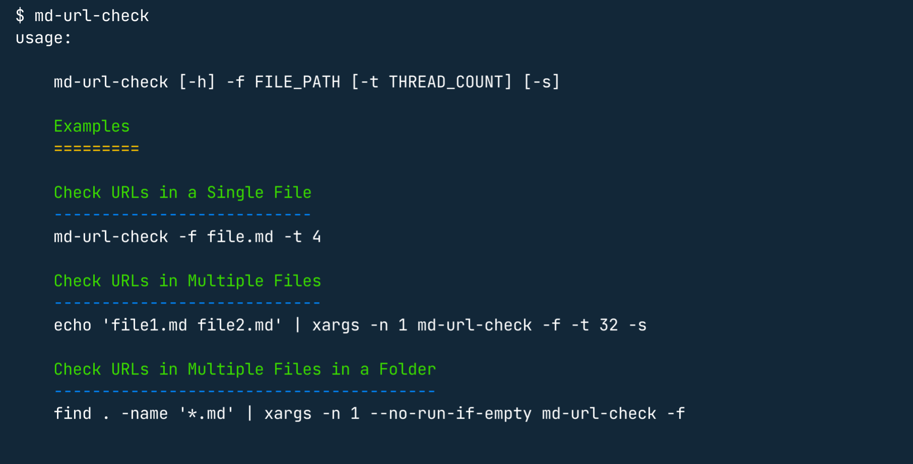

<div align="center">

<h1>Markdown URL Checker</h1>
<strong>>> <i>Simple CLI tool to check URL health in markdown files</i> <<</strong>

&nbsp;



</div>


## Installation

Install the CLI using pip:

```
pip install md-url-checker
```


## Usage


* To check the URLs in a single markdown file, run:

    ```
    md-url-check -f file.md
    ```

* To check the URLs in multiple markdown files, run:

    ```
    echo 'file1.md file2.md' | xargs -n 1 md-url-check -f
    ```

* To check the URLs in multiple files in a folder, run:

    ```
    find . -name '*.md' | xargs -n 1 --no-run-if-empty md-url-check -f
    ```

## Why
There are multiple 

<div align="center">
<i> ✨ 🍰 ✨ </i>
</div>
